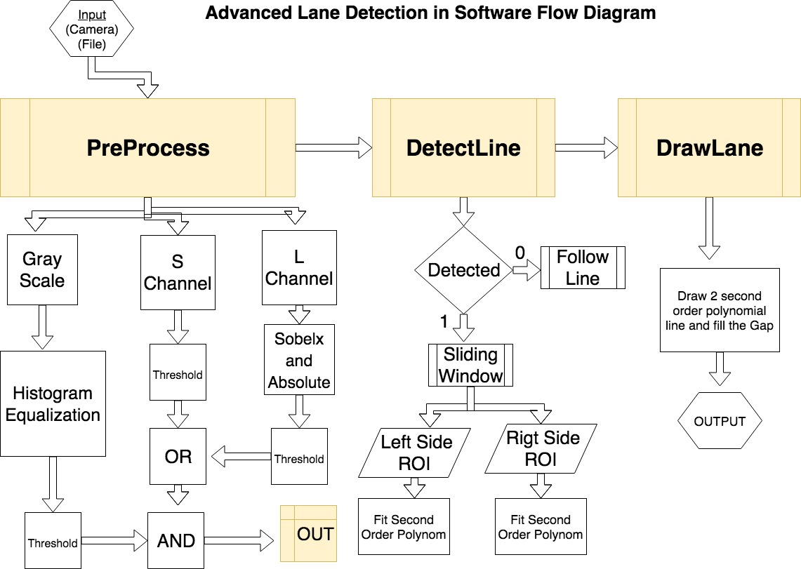
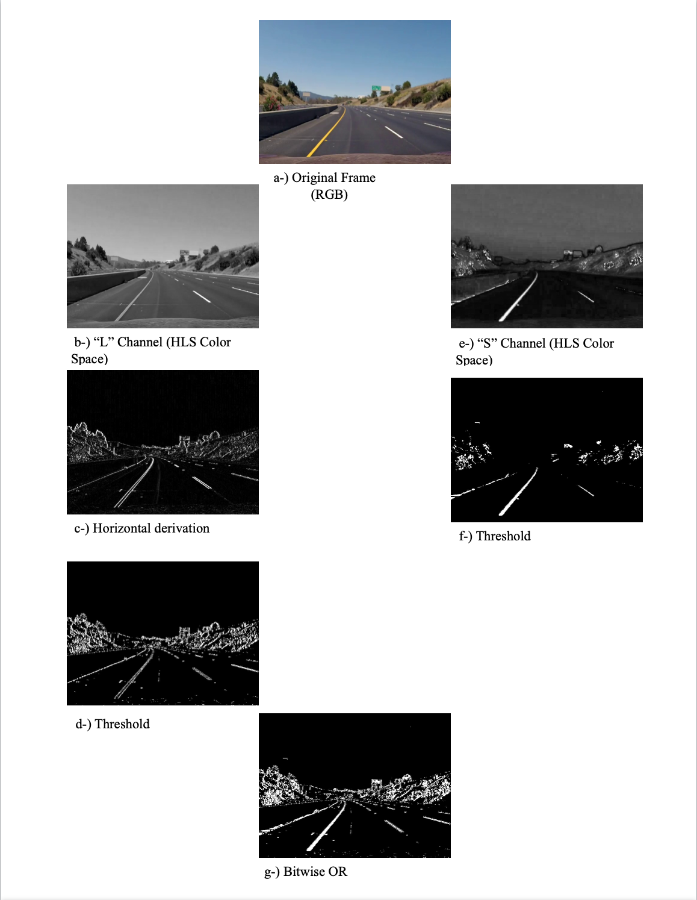
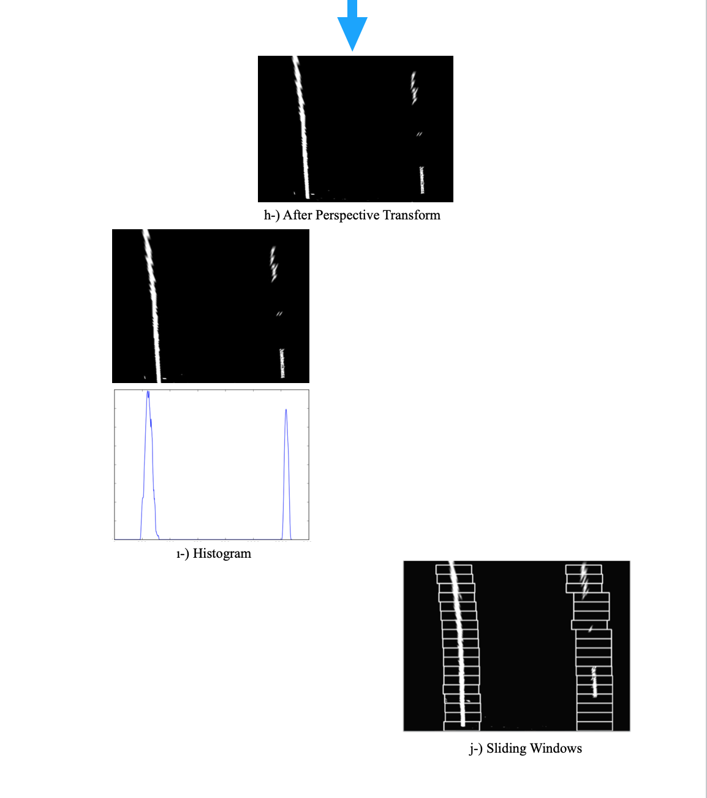
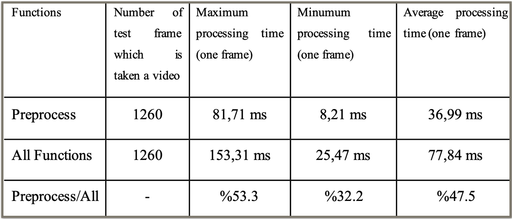
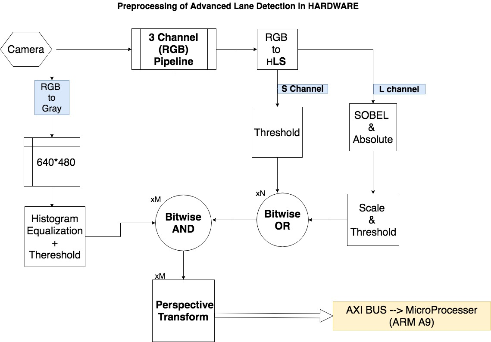
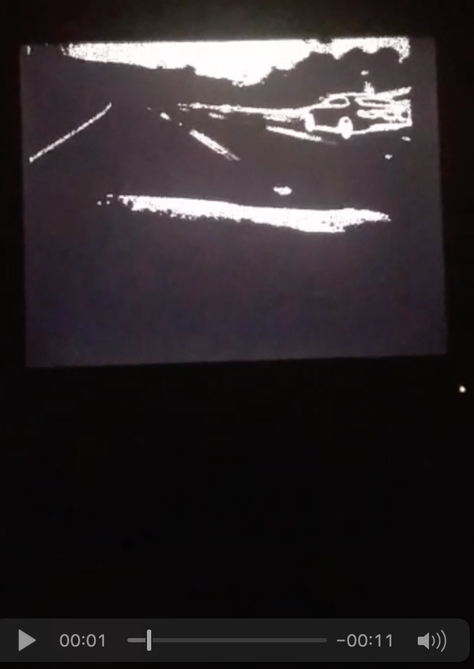

# Lane Detection with it's implementation on FPGA
Realization of 'Lane Detection' on CPU and implementation on FPGA using SDSOC and VIVADO.  

* Key terms for used softwares: C++, OpenCV, xfOpenCV, Verilog, Xilinx, Vivado, SdSoC.  

This project was realized in C ++ with OpenCV and was later implemented on FPGA using the xfOpenCV library.  

### Project Repositories
**1-)** :heavy_check_mark::heavy_check_mark: **Main Repo -Full Project-:** Lane Detection with implementation on FPGA (This Repository)   
2-) **C++ with OpenCV on just CPU without any acceleration with FPGA:** [Lane Detection on CPU Pure Software](https://github.com/ykpgrr/Lane-Detection-on-CPU-Pure-Software)  
3.1-) **C++ with OpenCV on Arm processor and xfopencv on Hardware in Zynq-7000 series FPGA's, all steps of algorithms** [Lane Detection on FPGA-HW/SW part with SDSoC](https://github.com/ykpgrr/Lane-Detection-on-FPGA-HW-SW-part-with-SDSoC)  
3.2-) **Verilog on hardware, only preprocess step:**  [Lane Detection on FPGA-HW part with VIVADO](https://github.com/ykpgrr/Lane-Detection-on-FPGA-HW-part-with-VIVADO)  /Lane-Detection-VIVADO-FPGA.git)  

# REALIZATION OF LANE DETECTION ALGORITHMS ON FPGA USING SDSOC AND VIVADO
## SUMMARY

The usage rate of image processing algorithms has gained a great impetus with the "OpenCV" library, which is implemented as open source. The lane detection algorithms, which are an advanced driver assistance system, are also one of the algorithms that using image processing techniques. Unfortunately, the image processing algorithms are slow on processors because of the processing intensity of image processing techniques. High-priced hardwares such as "Graphics Processing Unit" (GPU) are used to accelerate this slow operation. But the usage of GPU in projects increases the project costs, so the end user is offered as a product at high price. This situation reduces the usability of image processing techniques and applications in daily life.  

In this project, the Zedboard FPGA development card of the ZYNQ-7000 series of Xilinx Company is used as “System on Chip” (SoC) to solve this problem. A lane detection algorithm has been developed as an image processing project, and it has been implemented in the FPGA after this developed algorithm was broken down as software and hardware.  

According to the time analysis of the lane detection algorithm, the preprocessing part was implemented in hardware. SDSoC and Vivado platforms were used to make implementation of the developed lane detection algorithm on FPGA. Low level code (Verilog) is used in Vivado platform while high level code (C++) is used in SDSoC platform. In SDSoC platform, the "xfOpenCV" library was also used. The “xfOpenCV” library is a set of 50+ kernels, optimized for Xilinx FPGAs and SoCs, based on the OpenCV computer vision library. The kernels in the xfOpenCV library are optimized and supported in the Xilinx SDSoC Tool Suit.

## Software Flow Chart
In order to establish an advanced lane detection algorithm, we first tried to find two lines in a lane with the assumption that the right and left lines of a lane can be expressed a highly polynomial equation at the 2nd level. The area between these two equations represents the lane. The algorithm consists of three main parts; Preprocessing, Lane Detection, Lane Drawing. Figure below shows a Software Flowchart that previews these topics:  

Here is the some outputs on different steps of algorithm:

 

**Here is the example output of project as video:**  

 

## Hardware and Software Blocks

It has been thought that some part of the algorithm belonging to the system is implemented in hardware in order to implement the “Lane Detection System” faster. The Zedboard development card of the ZYNQ-7000 series of Xilinx company is suitable for this system because the algorithm can be separated on it as hardware and software parts so that it has been chosen. The software block is available on the ARM Cortex-A9 processor in Zedboard; the hardware block will be implemented in the logic cells of Zedboard.

#### A.	Time Analyze
The software time analysis on MacBook Pro Retina (13-inch Late 2012, 8 GB 1600 MHz DDR3 RAM, 2.5 GHz Intel Core i5) for 640 * 480 resolution highway driving videos on a Lane Detection System like that:  

#### B. Hardware Part
According to time analysis of the Lane Detection System, the algorithm is broken down on 2 parts. Preprocessing function is implemented in hardware (programming logic) and the other functions is implemented in software (programming software – Arm-A9). It has been decided that the preprocessing function should be implemented in hardware because of its processing cost. The hardware flow chart of the preprocessing function looks like this:  

 

**Here is the example output of ''Preprocess Step' on HW block as video:**  

 

## Results
The developed Advance Lane Detection Algorithm works successfully in the bends because it expresses the lines belonging to the lane with second degree polynomial equation. But when the bends are very sharp, such as mountain roads, the sketch is partially successful. The system also works successfully in different scenarios such as light, shade, strip lines drawn in different colors.

In order to develop a real-time ADAS system, it is necessary to process 15 frames at a time. In this project, 640 * 480 resolution image frame is given as input to the Advance Lane Detection System which is using "OpenCV" library in the "C ++" programming language. The system works at 12.84 fps on the computer (the computer specification is given in the Section 5). The "preprocessing function" takes 36.99 ms, while the entire software takes 77.84 ms for just one image frame on computer. Zedboard development card has ARM Cortex A9 processor. The Advance Lane Detection System works at 2.55 fps on the ARM Cortex A9 processor when the system works without hardware accelerator. The "preprocessing function" takes 226.88 ms, while the entire software takes 392.79 ms for just one image frame on computer. These differences of results are caused by processors which is used. Note that there is no hardware accelerator yet.

Using the "XfOpencv" library with C++ programming language via the SDSoC platform (High-Level Hardware Synthesize) on the Zedboard FPGA, it is achieved 8.78 fps for the "Preprocess Function"(without perspective transformation). If the hardware block is not used and implemented in the processor (without perspective transformation), the performance is 6.37fps. As a result, the SoC structure is implemented on the Zedboard with the SDSoC platform and with the "XfOpencv" library using the C++ programming language and the performance is 1.38 times better than pure software solution on the processor.

On the Vivado platform, a camera which is producing 25 MHz output was used. The programming language is Verilog hardware description language. The "preprocessing" function of the Advance Lane Detection System was implemented on the Zedboard FPGA development card. The function works in 12.3 ms. This means that the performance is **81.3 fps**. This result is **3.01 times** better than computer solution (2.5 GHz Intel Core i5) and **18.4 times** better than ARM Cortex A9 solution (667 MHz).

High-level language use in hardware designs is not widespread, but with technological advances, new tools are emerging in this area. The SDSoC platform is one of these tools developed by the Xilinx company. Designs with low-level language take a long time, and the lack of results in the short term leads to a high-level language development environment. It is not possible to transfer the pure software solutions for the processors to the hardware in the short term with low level hardware description languages.

When comparing the SDSoC and Vivado platforms, the high-level programming language "C ++" is used in SDSoC platform; a low-level hardware description language "Verilog" is used Vivado platform. While a big high-performance increase is not observed in hardware design made with a high-level language, it has been achieved in hardware design made with low level language.

The result of this project is; When the hardware design was made, high-level language can be used for reference solutions or for short-term solutions. On the other hand, low-level language is suitable for solutions where high-performance increase is expected in the long-term.

# Contributors
This is a graduate project which is named as "REALIZATION OF LANE DETECTION ALGORITHMS ON FPGA USING SDSOC AND VIVADO" at Istanbul Technical University, June 2018, and the final version of thesis is available in Turkish under `/docs` folder.  

Project members:  
Yakup GÖRÜR (gorury@itu.edu.tr, yakup.gorur@gmail.com) - Software and SDSoC  Platform  
Mehmet Akif AKKAYA (akifakkaya1@gmail.com) - VIVADO Platform  
Assoc. Prof. Dr. Sıddıka Berna ÖRS YALÇIN (Advisor)  

** **This project was supported by the Scientific and Technological Research Council of Turkey (TUBITAK).**
